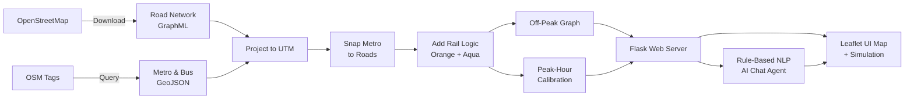

<p align="center">
  
</p>

<h1 align="center">🚦 V-NEURON</h1>

<p align="center">
  <strong>Unified Omnimodal Urban Navigation & Routing System for Nagpur</strong>
</p>

<p align="center">
  <a href="#-features"></a>
  <a href="#-tech-stack"></a>
  <a href="LICENSE"></a>
  <a href="https://github.com/Macbeth1501/V-NEURON"></a>
  
</p>

---

## 📌 About

**V-NEURON** is a state-of-the-art multimodal routing engine and interactive visualization platform designed specifically for **Nagpur, Maharashtra, India**. It consolidates Nagpur's **road network**, **walking pathways**, **metro rail infrastructure** (Orange & Aqua lines), and **bus transit stops** into a single, unified, weighted routing graph.

By evaluating journeys across both **free-flow (Off-Peak)** and **congested (Peak-Hour)** traffic scenarios, V-NEURON provides:

- 🛣️ High-fidelity multimodal route planning
- 🔄 Transfer indexing across transit modes
- 🚗 Real-time vehicle tracking simulation
- 🤖 Stateful **Agentic AI Chatbot** assistant

> Built as a **Final Year Project (FYP)** at SVPCET, Nagpur, V-NEURON demonstrates how graph theory, geospatial data, and modern AI can transform urban transit planning.

---

## Images


---

## ✨ Features

| Feature | Description |
|---|---|
| **Multimodal Routing** | Combines driving, metro, bus, and walking into a single shortest-path query using Dijkstra's algorithm on a unified NetworkX graph |
| **Dual Traffic Scenarios** | Compare Off-Peak vs Peak-Hour routing with realistic congestion-calibrated speeds |
| **Interactive Map** | Leaflet-based map with dynamic markers for 170+ metro stations, bus stops, landmarks, colleges, and hospitals |
| **Live Vehicle Simulation** | Animated vehicle tracking along computed routes with real-time telemetry (speed, mode, ETA, distance remaining) |
| **AI Assistant Chatbot** | Natural language interface that extracts origin, destination, and preferences conversationally to update routing states and controls |
| **Fuzzy Location Matching** | Robust geocoding with local cache, fuzzy matching, substring search, and Nominatim fallback |
| **Metro Rail Logic** | Full Orange Line (18 stations) & Aqua Line (19 stations) with boarding penalties and transfer costs |
| **Mode-Change Waypoints** | Visual markers on the map where transit mode switches occur (Road → Metro → Walk) |
| **Map Style Toggle** | Switch between Light (CartoDB Voyager/Positron) and Standard Street (OSM) tile layers |
| **Auto-Recalculate** | Route automatically recalculates when travel mode or time scenario changes |
| **Autocomplete Search** | Type-ahead search across all known locations with categorized suggestions |
| **Data Pipeline** | 15-step automated pipeline: download OSM → project → snap transit → calibrate → audit |

---

## 🧠 How It Works



### Data Pipeline Steps

| Step | Action | Output |
|------|--------|--------|
| 1 | Download Nagpur road network from OSM | `nagpur_roads.graphml` |
| 2 | Fetch metro stations & bus stops | `nagpur_metro.geojson`, `nagpur_bus_stops.geojson` |
| 3 | Push raw layers to PostGIS *(optional)* | Database tables |
| 4 | Project all layers to UTM (EPSG:32644) | Projected graphml & geojsons |
| 5 | Push projected layers + spatial indexes *(optional)* | Indexed DB tables |
| 6 | Snap metro stations to road network | `vneuron_multimodal_base.graphml` |
| 7 | Add Orange & Aqua metro rail edges | `vneuron_omnimodal_final.graphml` |
| 8 | Generate peak-hour calibrated network | `vneuron_calibrated_network.graphml` |
| 9 | Comparative route audit (SVPCET → Automotive Sq.) | Console output |

---

## 🛠️ Tech Stack

### Core Implementation
* **Backend**: Python 3.10+, Flask (Web API & Server), NetworkX (Graph structures & Dijkstra routing), OSMnx (OpenStreetMap API), GeoPandas / Shapely (Geospatial data & projections), PyProj (UTM Zone 44N transformation), Geopy (Geocoding).
* **Database**: PostgreSQL with PostGIS extension for spatial queries and GIST indexes.
* **Frontend**: HTML5, Vanilla CSS3 (Glassmorphism theme), Vanilla JS, Leaflet.js (Map rendering), FontAwesome (Icons).

### Alternate Architecture (FastAPI + React)
* **Backend**: FastAPI, Groq SDK (LLaMA 3.1 8B chat agent).
* **Frontend**: React 19, Vite 8, React-Leaflet, Framer Motion, Lucide React, Axios.

---

## 📂 Repository Structure

```text
V-NEURON/
├── README.md                  # Project handbook (this file)
├── .gitignore                 # Unified git exclusion rules
├── Project Title-2-RRSC.pdf   # Research & academic documentation
├── server.py                  # Main Flask Web API & Server
│
├── data/                      # Precompiled Nagpur multimodal graphs & GeoJSONs
│   ├── nagpur_metro.geojson
│   ├── nagpur_bus_stops.geojson
│   ├── vneuron_multimodal_base.graphml
│   ├── vneuron_omnimodal_final.graphml
│   └── vneuron_calibrated_network.graphml
│
├── templates/                 # Frontend HTML pages
│   └── index.html             # Dashboard UI structure
│
├── static/                    # Static UI resources
│   ├── css/
│   │   └── style.css          # Glassmorphic style layouts
│   └── js/
│       └── main.js            # Leaflet, simulator & chat events
│
└── scripts/                   # Data pipeline scripts (01_db_test.py to 15_comparative_audit.py)
    ├── 01_db_test.py
    ├── 02_road_network.py
    ├── 03_transit_data.py
    ├── 04_db_import.py
    ├── 05_crs_transform.py
    ├── 06_finalize_db.py
    ├── 07_route_analysis.py
    ├── 08_export_route.py
    ├── 09_test_custom_route_gps_based.py
    ├── 10_multimodal_snap.py
    ├── 11_metro_rail_logic.py
    ├── 12_omnimodal_test.py
    ├── 12_verify_metro.py
    ├── 13_route_analysis_v2.py
    ├── 14_transfer_penalties.py
    └── 15_comparative_audit.py
```

---

## ⚙️ Setup & Installation

### 1. Prerequisites
* **Python** 3.10+
* **PostgreSQL** with **PostGIS** extension.

### 2. Database Configuration
1. Open PostgreSQL (via pgAdmin or psql) and create `vneuron_db`:
   ```sql
   CREATE DATABASE vneuron_db;
   ```
2. Enable PostGIS:
   ```sql
   \c vneuron_db;
   CREATE EXTENSION postgis;
   ```
3. Update connection credentials in pipeline scripts if different from default (`postgres` / `sql123`).

### 3. Environment Setup
1. Navigate to the project root directory and activate the virtual environment:
   * **Windows (PowerShell)**:
     ```powershell
     .\V-NEURON-venv\Scripts\Activate.ps1
     ```
   * **Windows (CMD)**:
     ```cmd
     .\V-NEURON-venv\Scripts\activate.bat
     ```
2. Install dependencies:
   ```bash
   pip install flask geopy geopandas osmnx networkx pyproj sqlalchemy psycopg2-binary
   ```

---

## 🏃 Running the Application

### 1. Build Routing Graphs
Ensure PostgreSQL is active, then run the pipeline scripts sequentially (or use cached ones in `data/`):
```bash
python scripts/02_road_network.py
python scripts/03_transit_data.py
python scripts/04_db_import.py
python scripts/05_crs_transform.py
python scripts/06_finalize_db.py
python scripts/10_multimodal_snap.py
python scripts/11_metro_rail_logic.py
python scripts/14_transfer_penalties.py
```

### 2. Launch the Web Portal
Start the server:
```bash
python server.py
```
Open **[http://localhost:5000/](http://localhost:5000/)** in your browser.

---

## 🕹️ Interactive Guide

### Manual Input Routing
1. Type a place name (e.g. `Hingna` or `Medical Square`) into the start/destination search fields, or simply **click directly on the map** to place pins (Blue/Green for Start, Red for Destination).
2. Configure your trip:
   - **Time Scenario**: Select **Off-Peak** (free flow driving) or **Peak Hour** (heavy congestion, which incentives using the Metro).
   - **Travel Mode**: Choose **All Modes** (multimodal routing) or **Road Only** (restricted to road vehicles).
3. Click **Calculate Route** to compute and render the path. 

### Route Simulation
* Once a route is loaded, the **Route Tracking Simulator** panel will appear at the bottom-left.
* Click **Start tracking** to watch a blue indicator dot animate along the route.
* Toggle speed multipliers (`1x`, `2x`, `5x`, `10x`) to speed up or slow down the tracking.

### Chatbot Routing
* Expand the **V-NEURON AI Assistant** panel at the bottom-right.
* Type a routing prompt in plain English, e.g.:
  - *"I want to go from Hingna to Medical Square. There is heavy traffic."*
  - *"Take me from Airport to Sitabuldi."*
  - *"Route me from YCCE to Sadar under Peak Hour."*
* The assistant will parse the request, update the map, synchronize the sidebar buttons, and provide a textual itinerary summary!

---

## 📡 API Reference

### `POST /api/route`
Calculate a multimodal route between two locations.
* **Payload:**
  ```json
  {
    "origin": "VNIT",
    "destination": "Nagpur Junction",
    "scenario": "peak",
    "mode": "all_modes"
  }
  ```
* **Response:** Segment arrays containing coordinates, distance, travel time, and highway types.

### `POST /api/chat`
Interact with the stateful AI routing chatbot.
* **Payload:**
  ```json
  {
    "message": "I want to go from Airport to Sitabuldi during rush hour"
  }
  ```
* **Response:** Conversational reply + synchronized map route parameters.

---

## ⚙️ Calibration Constants

All project configuration is centralized in [`server.py`](server.py):

| Parameter | Value | Description |
|---|---|---|
| `CENTER_LATLON` | `(21.1458, 79.0882)` | Nagpur map center |
| `CRS_PROJECTED` | `EPSG:32644` | UTM Zone 44N projection for metric calculations |
| `METRO_SPEED_KMH` | `33` | Average speed of Nagpur Metro |
| `WALKING_SPEED_MPS` | `1.25` | Average walking speed (~4.5 km/h) |
| `BOARDING_PENALTY_S` | `300` | 5-minute wait time transfer penalty |

---

## 📊 Performance Statistics

| Metric | Value |
|---|---|
| Graph Nodes | ~110,000+ (road + transit) |
| Graph Edges | ~250,000+ |
| Metro Stations Connected | 37 |
| Bus Stops Indexed | 80+ |
| Route Computation | < 500ms typical |
| Geocoding (local cache) | < 1ms |
| Chatbot Parsing & Response | < 200ms |

---

## 👥 Team Members

* **Rochan Awasthi** — [LinkedIn](https://www.linkedin.com/in/rochan-awasthi-393242302/) | [Email](mailto:rochansawasthi@gmail.com)
* **Kashish Joseph** — [Email](mailto:kashishjoseph2@gmail.com)
* **Suraj Dhere** — [Email](mailto:surajdhere8300@gmail.com)
* **Shreya Doye** — [Email](mailto:doyeshreya18@gmail.com)

---

## 📄 License

This project is licensed under the **MIT License** — see the [LICENSE](LICENSE) file for details.

---

## 🙏 Acknowledgements

- **[OpenStreetMap](https://www.openstreetmap.org/)** — Road network & transit data
- **[OSMnx](https://github.com/gboeing/osmnx)** — Graph construction from OSM
- **[NetworkX](https://networkx.org/)** — Graph algorithms
- **[Leaflet](https://leafletjs.com/)** — Interactive map rendering
- **Nagpur Metro Rail Corporation** — Metro station data
