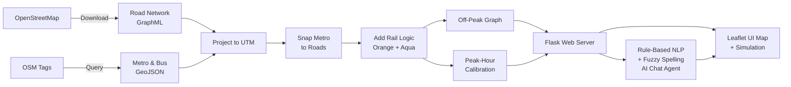

<p align="center">
  
</p>

<h1 align="center">🚦 V-NEURON-X</h1>

<p align="center">
  <strong>Unified Omnimodal Urban Navigation & Routing System for Nagpur</strong>
</p>

<p align="center">
  <a href="https://surajdhere-v-neuron-x.hf.space"></a>
  <a href="https://suraj.shinelikesun.workers.dev/vneuron"></a>
  <a href="https://github.com/Suraj-8300/V-NEURON-X"></a>
  
  
  
</p>

---

## 📌 About

**V-NEURON-X** is a state-of-the-art multimodal routing engine and interactive visualization platform designed specifically for **Nagpur, Maharashtra, India**. It consolidates Nagpur's **road network**, **walking pathways**, **metro rail infrastructure** (Orange & Aqua lines), and **bus transit stops** into a single, unified, weighted routing graph.

By evaluating journeys across both **free-flow (Off-Peak)** and **congested (Peak-Hour)** traffic scenarios, V-NEURON-X provides:

- 🛣️ High-fidelity multimodal route planning (Walk + Road + Metro)
- 🔄 Transfer indexing with boarding penalties across transit modes
- 🚗 Real-time animated vehicle tracking simulation
- 🤖 **AI Chatbot assistant** with natural language routing & **spelling correction**
- 📍 170+ landmarks, metro stations & bus stops on an interactive map

> Built as a **Final Year Project (FYP)** at SVPCET, Nagpur — demonstrating how graph theory, geospatial data, and modern AI can transform urban transit planning.

---

## 🖼️ Screenshots


---

## ✨ Features

| Feature | Description |
|---|---|
| **Multimodal Routing** | Combines driving, metro, and walking into a single shortest-path query (Dijkstra) on a unified NetworkX graph |
| **Dual Traffic Scenarios** | Compare Off-Peak (free flow) vs Peak-Hour (congested) routing with calibrated speeds |
| **Interactive Map** | Leaflet-based map with dynamic markers for 170+ metro stations, bus stops, landmarks, colleges, and hospitals |
| **Color-Coded Routes** | Each segment (Walk 🟡, Road 🔵, Metro 🟠/🔵) drawn in distinct colors with popup details |
| **Live Vehicle Simulation** | Animated vehicle tracking along computed routes with real-time speed, mode, ETA, and distance telemetry |
| **AI Assistant Chatbot** | Natural language interface — extracts origin, destination, and scenario to trigger routing automatically |
| **Spelling Correction** | Fuzzy matching (`difflib`) corrects typos in location names before geocoding |
| **Fuzzy Location Matching** | 4-tier geocoding: direct lookup → substring match → fuzzy match → Nominatim online |
| **Metro Rail Logic** | Full Orange Line (18 stations) & Aqua Line (19 stations) with boarding penalties and transfer costs |
| **Autocomplete Search** | Type-ahead search across all known locations with categorized suggestions |
| **Map Style Toggle** | Switch between Light (CartoDB) and Standard Street (OSM) tile layers |
| **Auto-Recalculate** | Route automatically recalculates when travel mode or time scenario changes |

---

## 🧠 How It Works



---

## 🛠️ Tech Stack

| Layer | Technology |
|---|---|
| **Backend** | Python 3.12, Flask, Gunicorn |
| **Routing** | NetworkX (Dijkstra), OSMnx (OSM graph builder) |
| **Geospatial** | GeoPandas, Shapely, PyProj (UTM Zone 44N) |
| **Geocoding** | Geopy / Nominatim, `difflib` fuzzy matching |
| **Frontend** | HTML5, Vanilla CSS3 (glassmorphism), Vanilla JS |
| **Map** | Leaflet.js, CartoDB & OSM tile layers |
| **Deployment** | Docker (Hugging Face Spaces), Cloudflare Workers (portfolio embed) |

---

## 📂 Repository Structure

```text
V-NEURON-X/
├── README.md                       # Project handbook (this file)
├── server.py                       # Main Flask Web API & routing engine
├── Dockerfile                      # Docker container for HF Spaces deployment
├── requirements.txt                # Python dependencies
├── .dockerignore                   # Docker build exclusions
├── .gitignore
├── Project Title-2-RRSC.pdf        # Academic research documentation
│
├── data/                           # Precompiled Nagpur multimodal graphs & GeoJSONs
│   ├── nagpur_metro.geojson        # Metro station point data
│   ├── nagpur_bus_stops.geojson    # Bus stop point data
│   ├── vneuron_omnimodal_final.graphml   # Off-peak full graph
│   ├── vneuron_omnimodal_final.pickle    # Cached fast-load version
│   ├── vneuron_calibrated_network.graphml # Peak-hour graph
│   └── vneuron_calibrated_network.pickle
│
├── templates/
│   └── index.html                  # Dashboard HTML structure
│
├── static/
│   ├── css/style.css               # Glassmorphic UI styles
│   └── js/main.js                  # Leaflet map, simulator & AI chat logic
│
└── scripts/                        # 15-step data pipeline (OSM → routable graph)
    ├── 01_db_test.py
    ├── 02_road_network.py          # Download Nagpur road graph from OSM
    ├── 03_transit_data.py          # Fetch metro & bus GeoJSONs
    ├── 10_multimodal_snap.py       # Snap metro stations to road network
    ├── 11_metro_rail_logic.py      # Add Orange & Aqua rail edges
    ├── 14_transfer_penalties.py    # Calibrate boarding/transfer penalties
    ├── 15_comparative_audit.py     # Validate routing outputs
    └── convert_to_pickle.py        # Pre-serialise graphs for fast startup
```

---

## 🚀 Deployment

### Option A — Live on Hugging Face Spaces (Docker)
The easiest way to run V-NEURON-X. No local setup needed:

**[▶ Open Live Demo → surajdhere-v-neuron-x.hf.space](https://surajdhere-v-neuron-x.hf.space)**

The Space uses the `Dockerfile` in this repo and loads precompiled `.pickle` graphs at startup.

---

### Option B — Run Locally with Docker

```bash
# Clone the repo
git clone https://github.com/Suraj-8300/V-NEURON-X.git
cd V-NEURON-X

# Build and run
docker build -t vneuron-x .
docker run -p 7860:7860 vneuron-x
```

Open **[http://localhost:7860](http://localhost:7860)** in your browser.

---

### Option C — Run Locally with Python (venv)

#### 1. Prerequisites
- Python 3.10+
- The precompiled graph files must be in `data/` (`.graphml` or `.pickle`)

#### 2. Setup
```bash
git clone https://github.com/Suraj-8300/V-NEURON-X.git
cd V-NEURON-X

python -m venv .venv
source .venv/bin/activate        # Windows: .venv\Scripts\activate

pip install -r requirements.txt
```

#### 3. Launch
```bash
python server.py
```

Open **[http://localhost:7860](http://localhost:7860)** in your browser.

> **Note:** If you don't have the graph pickle files, run the data pipeline scripts in `scripts/` sequentially (requires PostgreSQL + PostGIS for steps 3–6, optional otherwise).

---

## 🕹️ Usage Guide

### Manual Input Routing
1. Type a place name (e.g. `Hingna` or `Medical Square`) into the start/destination search fields — or **click directly on the map** to place pins.
2. Configure your trip:
   - **Time Scenario**: `Off-Peak` (free flow) or `Peak Hour` (heavy congestion, incentivises Metro)
   - **Travel Mode**: `All Modes` (multimodal) or `Road Only`
3. Click **Calculate Route** to compute and render the colour-coded path.

### Route Simulation
- Once a route is loaded, click **Start tracking** to watch an animated vehicle dot follow the route.
- Use speed multipliers (`1x`, `2x`, `5x`, `10x`) to control simulation speed.

### AI Assistant Chatbot
Expand the **V-NEURON AI Assistant** panel (bottom-right) and type naturally:

```
"I want to go from Hingna to Medical Square. There is heavy traffic."
"Take me from Airport to Sitabuldi by road only."
"Route me from YCCE to Sadar."
"hingan to medcal squre"   ← spelling correction handles typos automatically
```

The assistant parses your request, corrects spelling, updates the map, synchronises scenario controls, and replies with a formatted itinerary summary.

---

## 📡 API Reference

### `GET /api/stations`
Returns a sorted list of all known landmark and metro station names.

### `GET /api/landmarks/detailed`
Returns all landmarks with coordinates and type (`metro` or `landmark`).

### `POST /api/route`
Compute a route between two locations.
```json
{
  "origin": "VNIT",
  "destination": "Sadar",
  "scenario": "peak",
  "mode": "all_modes"
}
```
**Response:** `origin_name`, `destination_name`, `total_distance_km`, `total_time_min`, `path_coords`, `segments[]`

### `POST /api/chat`
Interact with the AI routing assistant.
```json
{ "message": "from Airport to Sitabuldi during rush hour" }
```
**Response:** `response` (markdown-formatted text), `route_data` (same shape as `/api/route`)

---

## ⚙️ Key Constants (`server.py`)

| Parameter | Value | Description |
|---|---|---|
| `CRS_PROJECTED` | `EPSG:32644` | UTM Zone 44N — metric distance calculations |
| `METRO_SPEED_KMH` | `33` | Average Nagpur Metro speed |
| `WALKING_SPEED_MPS` | `1.25` | Walking speed (~4.5 km/h) |
| `BOARDING_PENALTY_S` | `300` | 5-minute metro boarding/transfer penalty |
| Fuzzy match cutoff | `0.70` | Minimum similarity for spelling correction |

---

## 📊 Performance

| Metric | Value |
|---|---|
| Graph Nodes | ~110,000+ (road + transit) |
| Graph Edges | ~250,000+ |
| Metro Stations | 37 (Orange + Aqua lines) |
| Bus Stops Indexed | 80+ |
| Route Computation | < 500 ms typical |
| Geocoding (local cache) | < 1 ms |
| Chat Parse & Response | < 200 ms |

---

## 👥 Team

| Name | Contact |
|---|---|
| **Suraj Dhere** | [surajdhere8300@gmail.com](mailto:surajdhere8300@gmail.com) |
| **Rochan Awasthi** | [LinkedIn](https://www.linkedin.com/in/rochan-awasthi-393242302/) · [rochansawasthi@gmail.com](mailto:rochansawasthi@gmail.com) |
| **Kashish Joseph** | [kashishjoseph2@gmail.com](mailto:kashishjoseph2@gmail.com) |
| **Shreya Doye** | [doyeshreya18@gmail.com](mailto:doyeshreya18@gmail.com) |

---

## 📄 License

This project is licensed under the **MIT License** — see the [LICENSE](LICENSE) file for details.

---

## 🙏 Acknowledgements

- **[OpenStreetMap](https://www.openstreetmap.org/)** — Road network & transit data
- **[OSMnx](https://github.com/gboeing/osmnx)** — Graph construction from OSM
- **[NetworkX](https://networkx.org/)** — Graph algorithms & shortest-path routing
- **[Leaflet.js](https://leafletjs.com/)** — Interactive map rendering
- **[Hugging Face Spaces](https://huggingface.co/spaces)** — Free Docker hosting
- **Nagpur Metro Rail Corporation** — Metro station layout data
